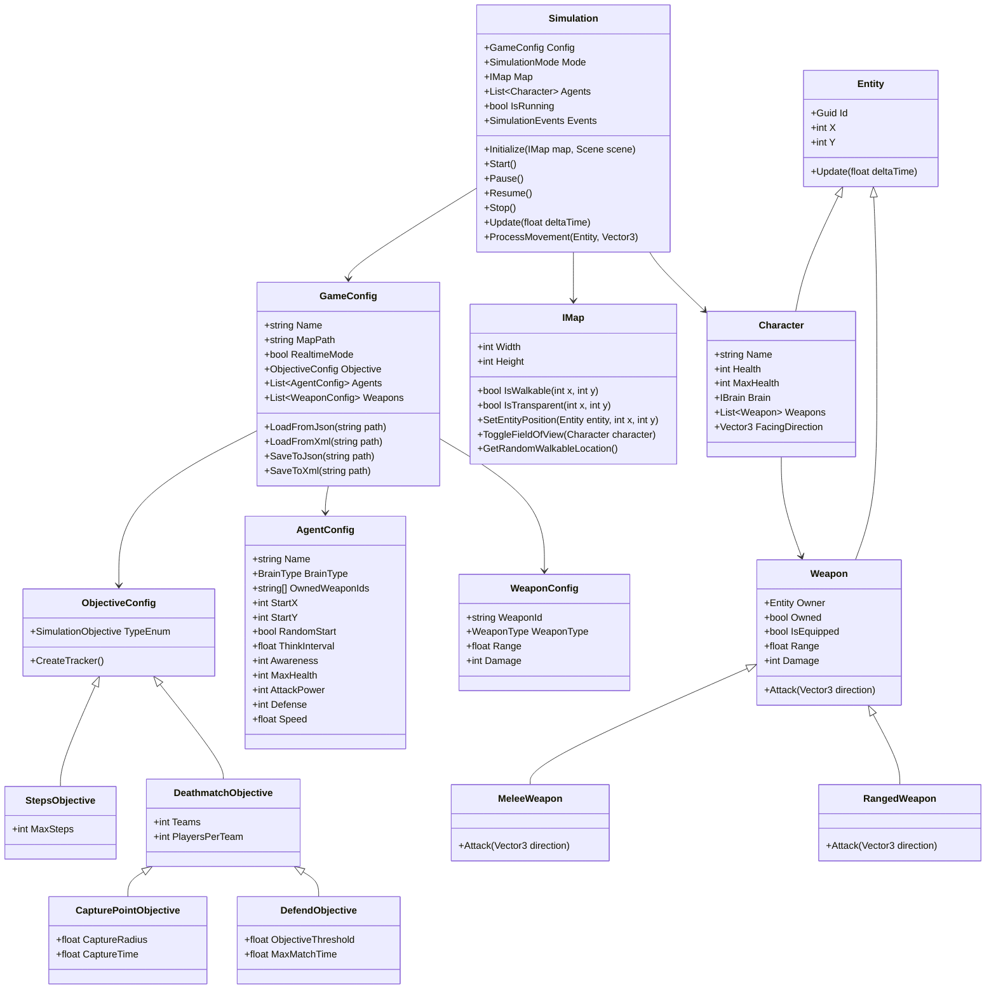
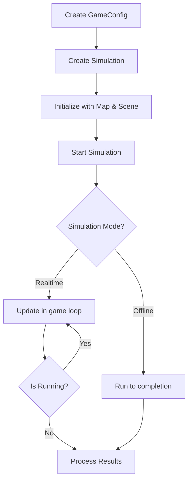

# Simulation Toolkit AI

A flexible and extensible simulation framework for AI-driven agent-based simulations. This toolkit provides a robust foundation for creating, configuring, and running simulations with multiple agents in various scenarios.

## Features

- **Flexible Simulation Engine**: Run simulations in real-time or offline mode
- **Agent-Based Architecture**: Create and manage multiple AI or human-controlled agents
- **Map System**: Grid-based map system with field of view calculations (based on RogueSharp)
- **Weapon System**: Support for different weapon types (melee and ranged)
- **Multiple Objective Types**: Support for various simulation objectives:
  - Team Deathmatch
  - Capture Point
  - Defense
  - Step-based simulations
- **Configuration Flexibility**: Easy setup through JSON or XML configuration files
- **Event System**: Comprehensive event system for monitoring simulation state changes

## Table of Contents

- [Installation](#installation)
- [Usage](#usage)
- [Configurations](#configurations)
  - [Game Configuration](#game-configuration)
  - [Agent Configuration](#agent-configuration)
  - [Weapon Configuration](#weapon-configuration)
  - [Objective Configuration](#objective-configuration)
- [Architecture](#architecture)
- [Credits](#credits)
- [Changelog](#changelog)

## Installation

1. Clone the repository:
```bash
git clone https://github.com/arbyun/Simulation-Toolkit-AI.git
```

2. Open the solution in your preferred IDE (Visual Studio, Rider, etc.)

3. Build the solution:
```bash
dotnet build
```

## Usage

### Basic Simulation Setup

```csharp
// Create a game configuration or load existing one from a path
GameConfig config = new GameConfig
{
    Name = "My Simulation",
    MapPath = "path/to/map.txt",
    RealtimeMode = true,
    Objective = new StepsObjective(SimulationObjective.Steps, 1000),
    Agents = new List<AgentConfig>
    {
        new AgentConfig
        {
            Name = "Agent1",
            BrainType = BrainType.AI,
            RandomStart = true,
            Awareness = 10,
            ThinkInterval = 0.5f // AI thinking interval in seconds
        }
    },
    Weapons = new List<WeaponConfig>
    {
        new WeaponConfig
        {
            WeaponId = "knife",
            WeaponType = WeaponType.Melee,
            Range = 1.5f,
            Damage = 15
        }
    }
};

// Create a simulation with the configuration
Simulation simulation = new Simulation(config, SimulationMode.Realtime);

// Initialize the simulation with a map and scene
IMap map = MapLoader.LoadMap(config.MapPath);
Scene scene = new Scene();
simulation.Initialize(map, scene);

// Start the simulation
simulation.Start();

// Update the simulation in a game loop (if in realtime mode)
while (simulation.IsRunning)
{
    simulation.Update(0.016f); // ~60 FPS
    // Render or process simulation state as needed
}
```

### Running an Offline Simulation

```csharp
// Create a configuration for offline mode
GameConfig config = new GameConfig
{
    Name = "Offline Simulation",
    MapPath = "path/to/map.txt",
    RealtimeMode = false,
    Objective = new StepsObjective(SimulationObjective.Steps, 1000),
    Agents = new List<AgentConfig>
    {
        // Only AI agents are supported in offline mode
        new AgentConfig { 
            Name = "AI1", 
            BrainType = BrainType.AI,
            OwnedWeaponIds = new[] { "knife" } 
        },
        new AgentConfig { 
            Name = "AI2", 
            BrainType = BrainType.AI,
            OwnedWeaponIds = new[] { "rifle" } 
        }
    },
    Weapons = new List<WeaponConfig>
    {
        new WeaponConfig
        {
            WeaponId = "knife",
            WeaponType = WeaponType.Melee,
            Range = 1.5f,
            Damage = 15
        },
        new WeaponConfig
        {
            WeaponId = "rifle",
            WeaponType = WeaponType.Ranged,
            Range = 8.0f,
            Damage = 25
        }
    }
};

// Create and run the simulation
Simulation simulation = new Simulation(config, SimulationMode.Offline);
IMap map = MapLoader.LoadMap(config.MapPath);
Scene scene = new Scene();
simulation.Initialize(map, scene);

// Access the results
simulation.Events.OnStopped += (sim, result) => {
    Console.WriteLine($"Simulation completed with result: {result}");
};

// In offline mode, Start() will run the simulation to completion
simulation.Start();
```

## Configurations

### Game Configuration

The `GameConfig` class is the main configuration for a simulation:

```json
{
  "Name": "Example Simulation",
  "MapPath": "maps/arena.txt",
  "RealtimeMode": true,
  "Objective": {
    "Type": "Steps",
    "TypeEnum": "Steps",
    "MaxSteps": 10000
  },
  "Agents": [
    {
      "Name": "AI Agent 1",
      "BrainType": "AI",
      "OwnedWeaponIds": ["knife"],
      "RandomStart": true,
      "ThinkInterval": 0.5,
      "Awareness": 10,
      "MaxHealth": 100,
      "AttackPower": 10,
      "Defense": 5,
      "Speed": 1.0
    },
    {
      "Name": "Human Player",
      "BrainType": "Human",
      "OwnedWeaponIds": ["rifle"],
      "RandomStart": true,
      "Awareness": 15,
      "MaxHealth": 120,
      "AttackPower": 15,
      "Defense": 3,
      "Speed": 1.2
    }
  ],
  "Weapons": [
    {
      "WeaponId": "knife",
      "WeaponType": "Melee",
      "Range": 1.5,
      "Damage": 15
    },
    {
      "WeaponId": "rifle",
      "WeaponType": "Ranged",
      "Range": 8.0,
      "Damage": 25
    }
  ]
}
```

### Agent Configuration

The `AgentConfig` class configures individual agents:

```json
{
  "Name": "Agent Name",
  "BrainType": "AI",  // "AI" or "Human"
  "OwnedWeaponIds": ["knife", "rifle"], // IDs of weapons this agent owns
  "StartX": 0,        // Starting X position (ignored if RandomStart is true)
  "StartY": 0,        // Starting Y position (ignored if RandomStart is true)
  "RandomStart": true, // Whether to use a random starting position
  "ThinkInterval": 0.5, // How often AI agents think (in seconds)
  "Awareness": 10,    // Field of view radius
  "MaxHealth": 100,   // Maximum health points
  "AttackPower": 10,  // Base attack power
  "Defense": 5,       // Base defense value
  "Speed": 1.0        // Movement speed multiplier
}
```

### Weapon Configuration

The `WeaponConfig` class configures weapons that can be assigned to agents:

```json
{
  "WeaponId": "knife",       // Unique identifier for the weapon
  "WeaponType": "Melee",     // "Melee" or "Ranged"
  "Range": 1.5,              // Attack range
  "Damage": 15               // Base damage
}
```

### Objective Configuration

The toolkit supports several objective types:

#### Steps Objective

Runs the simulation for a specified number of steps:

```json
{
  "Type": "StepsObjective",
  "TypeEnum": "Steps",
  "MaxSteps": 10000
}
```

#### Team Deathmatch Objective

Teams compete until only one team has surviving members:

```json
{
  "Type": "DeathmatchObjective",
  "TypeEnum": "TeamDeathmatch",
  "Teams": 2,
  "PlayersPerTeam": 5
}
```

#### Capture Point Objective

Teams compete to capture and hold a point for a specified time:

```json
{
  "Type": "CapturePointObjective",
  "TypeEnum": "CapturePoint",
  "Teams": 2,
  "PlayersPerTeam": 5,
  "CaptureRadius": 5.0,
  "CaptureTime": 60.0
}
```

#### Defense Objective

One team defends an objective while another team attacks:

```json
{
  "Type": "DefendObjective",
  "TypeEnum": "DefendObjective",
  "Teams": 2,
  "PlayersPerTeam": 5,
  "MaxMatchTime": 120.0,
  "ObjectiveThreshold": 0
}
```

## Architecture

The toolkit is built around several core components:



## Simulation Flow



## Credits

This project makes extensive use of the RogueSharp library for map handling, field of view calculations, and other grid-based functionality. Special thanks to:

- [RogueSharp](https://github.com/FaronBracy/RogueSharp) by Faron Bracy - A .NET Standard library that provides map generation, field-of-view calculations, and other roguelike game utilities.

## Changelog

<details> <summary>
<strong> 07/05/2025 - v1.0.0 </strong> </summary>

- The weapon system now supports different weapon types (melee and ranged)
- Agents can be assigned specific weapons through configuration
- AI agents can have configurable think intervals
- Configuration files can be in JSON or XML format
- The simulation engine has been enhanced with additional movement processing capabilities
- Program class has now basic usage examples
</details>
