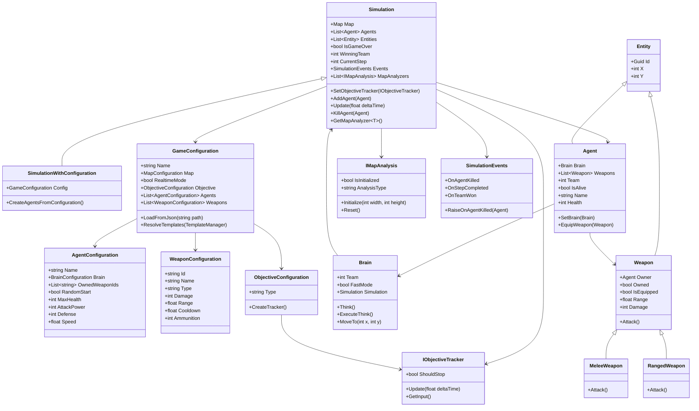
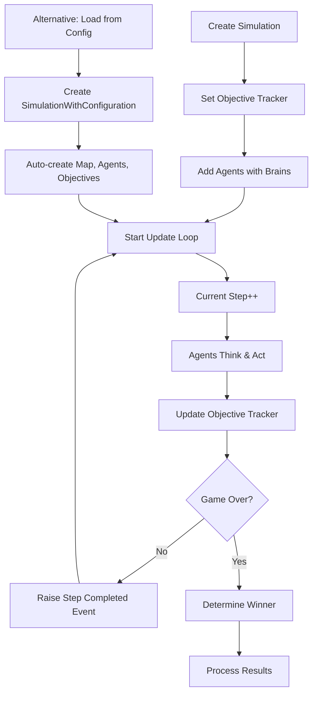

# SimArena

A flexible and extensible simulation framework for AI-driven agent-based simulations. This toolkit provides a robust foundation for creating, configuring, and running simulations with multiple agents in various scenarios.

## Features

- **Flexible Simulation Engine**: Run simulations with configurable tick rates
- **Agent-Based Architecture**: Create and manage multiple AI agents with different brain types
- **Map System**: Grid-based map system with multiple creation strategies (powered by RogueSharp)
- **Weapon System**: Support for different weapon types (melee and ranged) with configurable properties
- **Multiple Objective Types**: Support for various simulation objectives (currently implemented, open for extension):
  - Team Deathmatch
  - Capture Point
  - Defense
  - Step-based simulations
- **Configuration Flexibility**: Easy setup through JSON configuration files with template support
- **Event System**: Comprehensive event system for monitoring simulation state changes
- **Map Analysis System**: Track and analyze simulation events (e.g. deaths, damage, healing) for strategic AI decision making

## Table of Contents

- [Installation](#installation)
- [Usage](#usage)
- [Configurations](#configurations)
  - [Game Configuration](#game-configuration)
- [Documentation](#documentation)
- [Architecture](#architecture)
- [Game Engines](#game-engines)
- [Credits](#credits)
- [Changelog](#changelog)

## Installation

1. Clone the repository:
```bash
git clone https://github.com/arbyun/Simulation-Toolkit-AI.git
```

2. Open the solution in your preferred IDE (Visual Studio, Rider, etc.)

3. Build the solution:
```bash
dotnet build
```

4. Run the tests, if desired. You may also specify a path where the simulation will save your match logs into:
```bash
dotnet run -- "C:\Users\YOUR\PATH\HERE"
```

## Usage

### Basic Simulation Setup

```csharp
// Create a simulation with a randomly generated map
var simulation = new Simulation(width: 20, height: 20);

// Create the objective and tracker
var objective = new DeathmatchObjective(SimulationObjective.TeamDeathmatch, 2, 10);
var tracker = new DeathmatchTracker(objective);
simulation.SetObjectiveTracker(tracker);

// Create agents with brains
var (x1, y1) = Brain.GetRandomWalkableLocation(simulation.Map);
var brain1 = new RandomBrain(simulation.Map, team: 0);
var agent1 = new Agent(x1, y1, brain1, "Agent Red");
brain1.SetAgent(agent1);

var (x2, y2) = Brain.GetRandomWalkableLocation(simulation.Map);
var brain2 = new TacticalBrain(simulation.Map, team: 1);
var agent2 = new Agent(x2, y2, brain2, "Agent Blue");
brain2.SetAgent(agent2);

// Add agents to the simulation
simulation.AddAgent(agent1);
simulation.AddAgent(agent2);

// Run the simulation
while (!simulation.IsGameOver)
{
    simulation.Update(deltaTime: 1.0f);
}

Console.WriteLine($"Game Over! Winner: Team {simulation.WinningTeam}");
```

### Simulation through Configuration Files (Recommended)

```csharp
// Load the configuration
var config = GameConfiguration.LoadFromJson("configurations/team_deathmatch.json");

// Create the simulation
var simulation = new SimulationWithConfiguration(config);

// Run the simulation
while (!simulation.IsGameOver)
{
    simulation.Update(deltaTime: 1.0f);
}

Console.WriteLine($"Simulation '{config.Name}' completed! Winner: Team {simulation.WinningTeam}");
```

## Configurations

### Game Configuration

The `GameConfiguration` class is the main configuration for a simulation. Here's an example configuration:

```json
{
  "Name": "Team Deathmatch",
  "MapTemplate": {
    "TemplatePath": "medium_battlefield"
  },
  "RealtimeMode": false,
  "Objective": {
    "Type": "DeathmatchObjective",
    "ObjectiveType": "TeamDeathmatch",
    "Teams": 2,
    "PlayersPerTeam": 1
  },
  "AgentTemplates": [
    {
      "TemplatePath": "human_soldier",
      "Name": "Alpha Squad Leader",
      "Overrides": {
        "Brain.Team": 0,
        "MaxHealth": 120,
        "AttackPower": 18
      }
    },
    {
      "TemplatePath": "human_sniper",
      "Name": "Beta Sniper",
      "Overrides": {
        "Brain.Team": 1
      }
    }
  ],
  "Weapons": [
    {
      "Id": "assault_rifle",
      "Name": "M4A1 Assault Rifle",
      "Type": "RangedWeapon",
      "Damage": 25,
      "Range": 15,
      "Cooldown": 0.3,
      "Ammunition": 30
    },
    {
      "Id": "combat_knife",
      "Name": "Combat Knife",
      "Type": "MeleeWeapon",
      "Damage": 30,
      "Range": 1,
      "Cooldown": 0.8
    }
  ]
}
```

## Documentation

Further documentation and guidance can be found [here](https://arbyun.github.io/Simulation-Toolkit-AI/). 

## Architecture

The toolkit is built around several core components:



## Simulation Flow



## Game Engines

This project is engine agnostic, meaning that it can safely be used with any game engine that supports C#. 
For a Unity implementation example, check out the [Examples](https://github.com/arbyun/Simulation-Toolkit-AI-Examples) repository.

## Credits

This project makes extensive use of the RogueSharp library for map handling, field of view calculations, and other grid-based functionality. Special thanks to:

- [RogueSharp](https://github.com/FaronBracy/RogueSharp) by Faron Bracy - A .NET Standard library that provides map generation, field-of-view calculations, and other roguelike game utilities.

## Changelog

<details> <summary>
<strong> Latest - v2.0.0 </strong> </summary>

- Replaced MapQuerier with comprehensive IMapAnalysis system supporting death, damage, and healing tracking
- Brains now have access to simulation and map analyzers for strategic decision making
- Configurations support agent and map templates with override capabilities
- Enhanced IObjectiveTracker interface with better result handling
- Agents properly manage KDA, health, and team relationships
- Weapons support cooldowns, ammunition, and more realistic combat mechanics
- Comprehensive event tracking for simulation state changes
- JSON configurations support complex template references and overrides
</details>

<details> <summary>
<strong> 07/05/2025 - v1.0.0 </strong> </summary>

- The weapon system now supports different weapon types (melee and ranged)
- Agents can be assigned specific weapons through configuration
- AI agents can have configurable think intervals
- Configuration files can be in JSON or XML format
- The simulation engine has been enhanced with additional movement processing capabilities
- Program class has now basic usage examples
</details>
