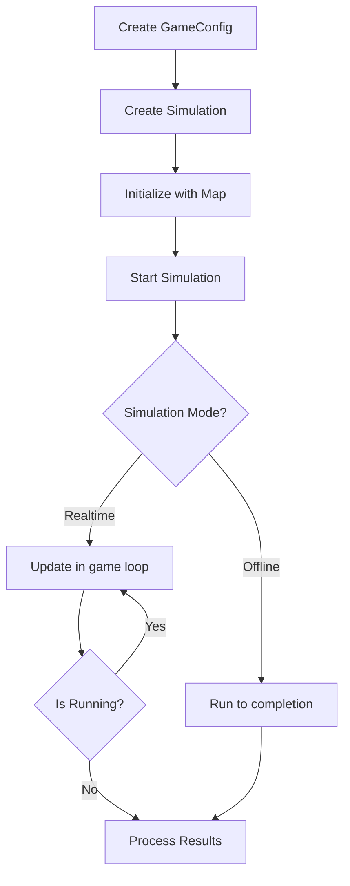

# Simulation Toolkit AI

A flexible and extensible simulation framework for AI-driven agent-based simulations. This toolkit provides a robust foundation for creating, configuring, and running simulations with multiple agents in various scenarios.

## Features

- **Flexible Simulation Engine**: Run simulations in real-time or offline mode
- **Agent-Based Architecture**: Create and manage multiple AI agents
- **Map System**: Grid-based map system (powered by RogueSharp)
- **Weapon System**: Support for different weapon types (melee and ranged)
- **Multiple Objective Types**: Support for various simulation objectives:
  - Team Deathmatch
  - Capture Point
  - Defense
  - Step-based simulations
- **Configuration Flexibility**: Easy setup through JSON configuration files
- **Event System**: Comprehensive event system for monitoring simulation state changes

## Table of Contents

- [Installation](#installation)
- [Usage](#usage)
- [Configurations](#configurations)
  - [Game Configuration](#game-configuration)
- [Documentation](#documentation)
- [Architecture](#architecture)
- [Game Engines](#game-engines)
- [Credits](#credits)
- [Changelog](#changelog)

## Installation

1. Clone the repository:
```bash
git clone https://github.com/arbyun/Simulation-Toolkit-AI.git
```

2. Open the solution in your preferred IDE (Visual Studio, Rider, etc.)

3. Build the solution:
```bash
dotnet build
```

4. Run the tests, if desired. You may also specify a path where the simulation will save your match logs into:
```bash
dotnet run -- "C:\Users\YOUR\PATH\HERE"
```

## Usage

### Basic Simulation Setup

```csharp
// Create a map
var map = new Map(10, 10);

// Create a simulation
var simulation = new Simulation(map);

// Decide speed of the simulation
float updateRate = 0.5f; // Update every 0.5 seconds

// Create the objective and tracker
var objective = new DeathmatchObjective(SimulationObjective.TeamDeathmatch, 2, 3);
var tracker = new DeathmatchTracker(objective);
simulation.SetObjectiveTracker(tracker);

// Create sample agents
var agent1 = new Agent(0, 0, simulation);
var agent2 = new Agent(9, 9, simulation);

// Create a brain for the agents (Optional)
var brain1 = new RandomBrain(agent1, map, 0);
var brain2 = new RandomBrain(agent2, map, 1);
agent1.SetBrain(brain1);
agent2.SetBrain(brain2);

// Add weapons to the agents (Optional)
var weapon1 = new MeleeWeapon(0, 0, simulation);
var weapon2 = new MeleeWeapon(9, 9, simulation);
agent1.EquipWeapon(weapon1);
agent2.EquipWeapon(weapon2);

// Add agents to the simulation
simulation.AddAgent(agent1);
simulation.AddAgent(agent2);

// Run the simulation
while (!simulation.IsGameOver)
{
    simulation.Update(updateRate);
}
```

### Simulation through Configuration Files

```csharp
// Load the configuration
var config = GameConfiguration.LoadFromJson("path/to/config.json");

// Create the simulation
var simulation = new SimulationWithConfiguration(config);

// Decide speed of the simulation
float updateRate = 0.5f; // Update every 0.5 seconds

// Run the simulation
while (!simulation.IsGameOver)
{
    simulation.Update(updateRate);
}
```

## Configurations

### Game Configuration

The `GameConfig` class is the main configuration for a simulation:

```json
{
  "Name": "Example Simulation",
  "MapConfiguration": {
    "Type": "Simple",
    "Width": 40,
    "Height": 40
  }
  "Objective": {
    "Type": "Steps",
    "TypeEnum": "Steps",
    "MaxSteps": 10000
  },
  "Agents": [
    {
      "Name": "AI Agent 1",
      "BrainType": "AI",
      "OwnedWeaponIds": ["knife"],
      "RandomStart": true,
      "ThinkInterval": 0.5,
      "Awareness": 10,
      "MaxHealth": 100,
      "AttackPower": 10,
      "Defense": 5,
      "Speed": 1.0
    },
    {
      "Name": "Human Player",
      "BrainType": "Human",
      "OwnedWeaponIds": ["rifle"],
      "RandomStart": true,
      "Awareness": 15,
      "MaxHealth": 120,
      "AttackPower": 15,
      "Defense": 3,
      "Speed": 1.2
    }
  ],
  "Weapons": [
    {
      "WeaponId": "knife",
      "WeaponType": "Melee",
      "Range": 1.5,
      "Damage": 15
    },
    {
      "WeaponId": "rifle",
      "WeaponType": "Ranged",
      "Range": 8.0,
      "Damage": 25
    }
  ]
}
```

## Documentation

Further documentation and guidance can be found [here](arbyun.github.io/Simulation-Toolkit-AI/). 

## Architecture

The toolkit is built around several core components:


## Simulation Flow



## Game Engines

This project is engine agnostic, meaning that it can safely be used with any game engine that supports C#. For a Unity implementation example, check out the [Examples](https://github.com/arbyun/Simulation-Toolkit-AI-Examples) repository.

## Credits

This project makes extensive use of the RogueSharp library for map handling, field of view calculations, and other grid-based functionality. Special thanks to:

- [RogueSharp](https://github.com/FaronBracy/RogueSharp) by Faron Bracy - A .NET Standard library that provides map generation, field-of-view calculations, and other roguelike game utilities.

## Changelog

<details> <summary>
<strong> 07/05/2025 - v1.0.0 </strong> </summary>

- The weapon system now supports different weapon types (melee and ranged)
- Agents can be assigned specific weapons through configuration
- AI agents can have configurable think intervals
- Configuration files can be in JSON or XML format
- The simulation engine has been enhanced with additional movement processing capabilities
- Program class has now basic usage examples
</details>
